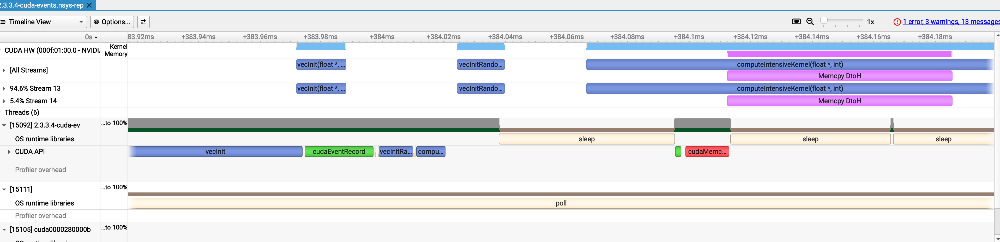

# Section 2: Programming Interface - CUDA Examples

This document contains examples from Section 2 of the [CUDA Programming Guide v13.1](https://docs.nvidia.com/cuda/cuda-programming-guide/index.html) - Programming Interface.

## Table of Contents

- [2.1.3 Memory Management (`memory-vecAdd.cu`)](#213-memory-management-memory-vecaddcu)
- [2.1.10 Thread Block Clusters (`thread-cluster.cu`)](#2110-thread-block-clusters-thread-clustercu)
- [2.2.3.8 Distributed Shared Memory (`dist-memory.cu`)](#2238-distributed-shared-memory-dist-memorycu)
- [2.3.3.4 Asynchronous Concurrent Execution (`cuda-events.cu`)](#2334-asynchronous-concurrent-execution-cuda-eventscu)

---

## 2.1.3 Memory Management (`memory-vecAdd.cu`)

**Reference**: [CUDA Programming Guide Section 2.1.3 - Memory in GPU Computing Programming](https://docs.nvidia.com/cuda/cuda-programming-guide/02-basics/intro-to-cuda-cpp.html#memory-in-gpu-computing)

**File**: [src/2.1.3-memory-vecAdd.cu](src/2.1.3-memory-vecAdd.cu)

Demonstrates different memory management techniques for GPU programming:
- **Unified Memory**: Using `cudaMallocManaged()` for automatic memory management between host and device
- **Explicit Memory**: Manual memory allocation using `cudaMalloc()` and `cudaMemcpy()` for data transfers

**Key Concepts:**
- Host-device memory management strategies
- Unified Memory vs. explicit memory transfers
- Memory allocation best practices with `cudaMallocHost()` for pinned memory

**How to compile and run:**
```bash
nvcc -arch=native -o bin/vecAdd src/2.1.3-memory-vecAdd.cu
./bin/vecAdd
```

**Expected output:**
```
Unified Memory: CPU and GPU answers match
Explicit Memory: CPU and GPU answers match
```

---

## 2.1.10 Thread Block Clusters (`thread-cluster.cu`)

**Reference**: [CUDA Programming Guide Section 2.1.10 - Thread Block Clusters](https://docs.nvidia.com/cuda/cuda-programming-guide/02-basics/intro-to-cuda-cpp.html#thread-block-clusters)

**File**: [src/2.1.10-thread-cluster.cu](src/2.1.10-thread-cluster.cu)

Demonstrates the use of thread block clusters, a feature for advanced GPU architectures (compute capability 9.0+).

**Key Concepts:**
- Compile-time cluster size specification with `__cluster_dims__()` attribute
- Cluster-based kernel launch configuration
- Cooperative groups API for cluster operations

**Requirements:**
- GPU with compute capability 9.0 or higher (e.g., Hopper architecture or newer)

**How to compile and run:**
```bash
nvcc -arch=native -o bin/threadCluster src/2.1.10-thread-cluster.cu
./bin/threadCluster
```

**Note:** Will fail on older architectures with: `error: __cluster_dims__ is not supported for this GPU architecture`

---

## 2.2.3.8 Distributed Shared Memory (`dist-memory.cu`)

**Reference**: [CUDA Programming Guide Section 2.2.3.8 - Distributed Shared Memory](https://docs.nvidia.com/cuda/cuda-programming-guide/02-basics/writing-cuda-kernels.html#distributed-shared-memory)

**File**: [src/2.2.3.8-dist-memory.cu](src/2.2.3.8-dist-memory.cu)

Demonstrates distributed shared memory across thread block clusters for histogram computation.

**Key Concepts:**
- Accessing shared memory across thread blocks within a cluster
- `cluster.map_shared_rank()` for cross-block shared memory access
- Cluster synchronization with `cluster.sync()`
- Dynamic shared memory configuration with `cudaFuncSetAttribute()`

**Architecture Pattern:**
```
Cluster of Thread Blocks
  ├─ Block 0: Shared Memory [bins 0-4]
  └─ Block 1: Shared Memory [bins 5-9]
       ↓
  Threads can atomically update bins in any block's shared memory
```

**How to compile and run:**
```bash
nvcc -O2 -arch=native -o bin/dist-memory src/2.2.3.8-dist-memory.cu
./bin/dist-memory
```

**Requirements:**
- Compute capability 9.0+ for cluster support

---

## 2.3.3.4 Asynchronous Concurrent Execution (`cuda-events.cu`)

**Reference**: [CUDA Programming Guide Section 2.3.3 - Cuda Events](https://docs.nvidia.com/cuda/cuda-programming-guide/02-basics/asynchronous-execution.html#cuda-events)

**File**: [src/2.3.3.4-cuda-events.cu](src/2.3.3.4-cuda-events.cu)

Demonstrates advanced stream management using CUDA events to coordinate asynchronous operations across multiple streams.

**CUDA Events and Asynchronous Stream Execution**

Demonstrates advanced stream management using CUDA events to coordinate asynchronous operations across multiple streams.

**Concept:**
This program illustrates how CUDA events enable fine-grained synchronization between operations on different streams without blocking the host CPU. The key technique shown is:
1. Launching kernels on one stream (stream1)
2. Recording an event after a specific kernel completes
3. Using `cudaEventQuery()` to non-blockingly check if that kernel has finished
4. Starting an asynchronous memory copy on a separate stream (stream2) as soon as the event signals completion
5. Continuing CPU work concurrently with GPU operations

**Architecture:**
```
Stream 1:  [vecInit] --EVENT--> [vecInitRandom] --> [computeIntensiveKernel]
                        ↓
                    (query event)
                        ↓
Stream 2:               [cudaMemcpyAsync D→H]

CPU:       [doNextChunkOfCPUWork...] (runs concurrently)
```

**Features:**
- **Dual Stream Execution**: Separates compute (stream1) from data transfer (stream2)
- **Event-Based Coordination**: Uses `cudaEventRecord()` and `cudaEventQuery()` to trigger actions without blocking
- **CPU/GPU Overlap**: CPU continues working while GPU kernels execute
- **Compute Kernels**:
  - `vecInit`: Initializes array with a constant value
  - `vecInitRandom`: Populates array with pseudo-random values
  - `computeIntensiveKernel`: Performs heavy mathematical operations (sin, cos, sqrt, exp, log, pow)
- **Pinned Memory**: Uses `cudaMallocHost()` for faster async transfers
- **Comprehensive Error Checking**: All CUDA calls wrapped in `CUDA_CHECK` macro

**How it works:**
1. Allocate device and pinned host memory
2. Create two streams for parallel execution
3. Launch `vecInit` kernel on stream1 and immediately record an event
4. Launch additional compute kernels on stream1
5. While GPU is busy, CPU polls the event in a non-blocking loop
6. As soon as the event indicates `vecInit` completed, start async D2H copy on stream2
7. CPU continues its work while both streams execute concurrently
8. Synchronize both streams before cleanup

**Why this matters:**
- **Overlap**: Demonstrates how to overlap computation with data transfer
- **CPU Utilization**: CPU isn't blocked waiting for GPU
- **Efficiency**: Multiple operations execute simultaneously across streams
- **Real-world Pattern**: Common in production pipelines where you want to copy results back as soon as they're ready, without waiting for all GPU work to finish

**How to compile and run:**
```bash
nvcc -O2 -arch=native -o bin/2.3.3.4-cuda-events src/2.3.3.4-cuda-events.cu
./bin/2.3.3.4-cuda-events
```

**Expected output:**
```
work_left 5
work_left 4
work_left 3
work_left 2
work_left 1
start async copy
work_left 0
```

**Profile with Nsight Systems:**
```bash
nsys profile -o reports/2.3.3.4-cuda-events ./bin/2.3.3.4-cuda-events
```
The timeline will show stream1 and stream2 executing concurrently, with the memory copy starting before all compute kernels finish.

**Nsight Systems Timeline Analysis:**



The Nsight Systems profile captures the execution behavior described above:

**Timeline Overview:**
- **CUDA HW (Kernel Memory)**: Shows actual kernel execution on the GPU hardware
  - `vecInit(float*)` kernels execute on the GPU
  - `vecInitRando` (vecInitRandom) follows
  - `computeIntensiveKernel(float*, int)` performs heavy computation
  - `Memcpy DtoH` (Device-to-Host) transfers data asynchronously

**Stream Activity:**
- **Stream 13 (94.6%)**: Primary compute stream executing initialization and compute kernels
- **Stream 14 (5.4%)**: Secondary stream handling asynchronous memory copy operations

**CUDA API Calls:**
The CUDA API row shows the host-side calls in sequence:
- `vecInit`: Launches the initialization kernel
- `cudaEventRecord`: Records the event immediately after `vecInit` launch
- `vecInitRa...`: Launches `vecInitRandom` kernel
- `compu...`: Launches `computeIntensiveKernel`
- `cudaMemc...`: Initiates the asynchronous memory copy on stream2

**Key Observations:**
1. **Event-Based Synchronization**: The `cudaEventRecord` call (shown in green) occurs immediately after the first `vecInit` launch, allowing the CPU to query completion status without blocking.

2. **Async Memory Copy on Different Stream**: The `cudaMemc...` operation (shown in red) executes on a separate stream (Stream 14), demonstrating true asynchronous behavior where data transfer happens independently from ongoing compute operations on Stream 13.

3. **CPU/GPU Overlap**: The OS runtime libraries row shows `sleep` periods, indicating the CPU is free to perform other work while GPU operations execute. The `poll` operations represent the non-blocking event queries checking if `vecInit` has completed.

4. **Concurrent Execution**: Multiple kernel executions overlap on the timeline, and the memory copy starts before all compute kernels finish, exactly as intended by the program design.

This visualization confirms the effectiveness of using CUDA events for fine-grained stream coordination and achieving efficient CPU/GPU overlap without blocking synchronization.

---

## Additional Resources

- [CUDA Programming Guide](https://docs.nvidia.com/cuda/cuda-programming-guide/index.html)
- [CUDA C++ Best Practices Guide](https://docs.nvidia.com/cuda/cuda-c-best-practices-guide/index.html)
- [Nsight Systems Documentation](https://docs.nvidia.com/nsight-systems/)
