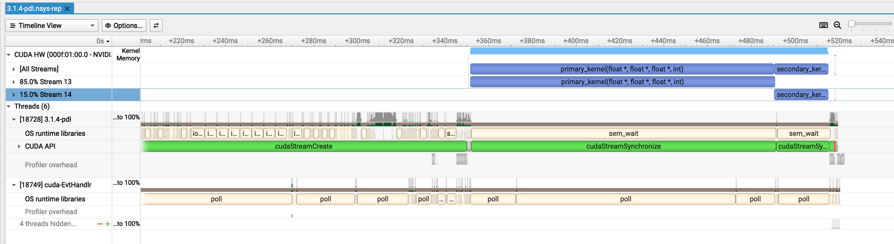

# Programmatic Dependent Launch (PDL) Investigation: No Concurrent Execution Observed on GB10

## Hardware & Software Configuration
- **GPU**: NVIDIA GB10 (DGX Spark)
- **Compute Capability**: 12.1
- **CUDA Version**: 13.0
- **Driver**: Latest
- **OS**: Linux
- **Profiling Tool**: Nsight Systems

## Overview

I've been testing CUDA's Programmatic Dependent Launch (PDL) feature introduced in recent CUDA versions. Despite multiple configuration attempts, I'm unable to observe concurrent kernel execution between the primary and secondary kernels as suggested by the documentation.

## Implementation

The test implementation follows the PDL pattern from the CUDA Programming Guide:

### Primary Kernel
```cuda
__global__ void primary_kernel(float* input, float* output, float* dummy, int size) {
    int idx = blockIdx.x * blockDim.x + threadIdx.x;
    
    if (idx < size) {
        // Critical work: write output for secondary kernel
        output[idx] = busy_work(input[idx], 10000);
    }

    // Trigger point - signal secondary kernel can start
    cudaTriggerProgrammaticLaunchCompletion();

    if (idx < size) {
        // Post-trigger work that should overlap with secondary
        float extra = busy_work(input[idx] * 2.0f, 20000);
        dummy[idx] = extra;  // Prevent compiler optimization
    }
}
```

### Secondary Kernel
```cuda
__global__ void secondary_kernel(float* data, int size) {
    int idx = blockIdx.x * blockDim.x + threadIdx.x;
    
    // Independent work (doesn't need primary's output)
    float local_computation = 0.0f;
    if (idx < size) {
        local_computation = busy_work((float)idx, 3000);
    }

    // Wait for primary kernel's trigger point
    cudaGridDependencySynchronize();

    // Dependent work using primary's output
    if (idx < size) {
        float primary_result = data[idx];
        data[idx] = primary_result * 2.0f + local_computation * 0.001f;
    }
}
```

### Launch Configuration
```cuda
// Secondary kernel with PDL attribute
cudaLaunchAttribute attribute[1];
attribute[0].id = cudaLaunchAttributeProgrammaticStreamSerialization;
attribute[0].val.programmaticStreamSerializationAllowed = 1;

cudaLaunchConfig_t config = {0};
config.gridDim = secondaryBlocks;
config.blockDim = threadsPerBlock;
config.stream = stream2;
config.attrs = attribute;
config.numAttrs = 1;

// Launch primary (standard syntax)
primary_kernel<<<primaryBlocks, threadsPerBlock, 0, stream1>>>(d_input, d_output, d_dummy, size);

// Launch secondary (with PDL attribute)
cudaLaunchKernelEx(&config, secondary_kernel, d_output, size);
```

## Configurations Tested

### 1. Small Grid (Minimal Resource Usage)
- **Size**: 1K elements (4 blocks)
- **Threads per block**: 256
- **Expected**: Maximum opportunity for overlap
- **Result**: Sequential execution

### 2. Large Grid with Limited Primary
- **Size**: 256K elements (1024 blocks total)
- **Primary blocks**: 96 (2 blocks/SM on 48 SMs = 33% capacity)
- **Secondary blocks**: 1024 (100% of workload)
- **Rationale**: Leave 67% of SM resources available (4 blocks/SM free)
- **Expected**: 192 secondary blocks can overlap with primary in first wave
- **Result**: Sequential execution (confirmed via Nsight Systems timeline screenshot)

### 3. Separate Streams
- **Configuration**: Primary on stream1, secondary on stream2
- **Rationale**: Eliminate stream ordering constraints
- **Result**: Sequential execution

### 4. Extended Post-Trigger Work
- **Primary post-trigger**: 20,000 iterations (67% of kernel time)
- **Primary pre-trigger**: 10,000 iterations (33% of kernel time)
- **Rationale**: Create large overlap window
- **Result**: Sequential execution

## Occupancy Analysis

I verified that concurrent execution is theoretically possible using both runtime queries and compiler output:

### GPU Hardware Specifications
```
GPU: NVIDIA GB10
Compute Capability: 12.1
SMs: 48
Max threads per SM: 1536
Max threads per block: 1024
Max blocks per SM: 24
Registers per SM: 65536
Registers per block: 65536
```

### Kernel Resource Usage (from nvcc -res-usage)
```
Primary kernel (_Z14primary_kernelPfS_S_i):
- Registers: 28 per thread
- Shared memory: 0 bytes
- Stack frame: 0 bytes
- Barriers: 0

Secondary kernel (_Z16secondary_kernelPfi):
- Registers: 28 per thread
- Shared memory: 0 bytes
- Stack frame: 0 bytes
- Barriers: 0
```

### Occupancy Calculation (256 threads/block)
```
Primary kernel:
- Blocks per SM: 6
- Occupancy: 100.0% (1536/1536 threads)
- Optimal block size: 768 threads

Secondary kernel:
- Blocks per SM: 6
- Occupancy: 100.0% (1536/1536 threads)
- Optimal block size: 768 threads
```

**What "6 blocks per SM" means**: Given the kernel's resource usage (28 registers/thread, 0 shared memory), each SM can schedule up to 6 blocks of 256 threads simultaneously. This is calculated based on:
- Register limit: (65536 registers/SM) / (28 registers/thread × 256 threads/block) = 9.1 blocks (not the bottleneck)
- Thread limit: (1536 max threads/SM) / (256 threads/block) = **6 blocks** ← bottleneck
- Block limit: 24 max blocks/SM (not the bottleneck)

The minimum of these three constraints determines the actual blocks per SM.

### Concurrent Execution Feasibility
```
Resources needed for concurrent execution:
- Primary:   6 blocks/SM
- Secondary: 6 blocks/SM
- Total:     12 blocks/SM

Available: 24 blocks/SM

Conclusion: Hardware CAN support concurrent execution ✓
           (12 blocks needed < 24 blocks available)
```

**Test Configuration**: Launched primary with 256 blocks (25% capacity) to explicitly leave resources available for secondary kernel (1024 blocks).

## Profiling Results

**Kernel Execution Times** (from Nsight Systems cuda_gpu_kern_sum):
```
Configuration:
- Primary kernel:   96 blocks (2 blocks/SM on 48 SMs = 33% capacity)
- Secondary kernel: 1024 blocks (full workload)
- Separate streams: stream1 (primary), stream2 (secondary)
- Work per thread: Primary (10k pre-trigger + 20k post-trigger iterations)
                   Secondary (3k independent + dependent work)

Execution Times:
Primary kernel:   138.72 ms (85.0% of GPU time)
Secondary kernel:  24.47 ms (15.0% of GPU time)
Total sequential: 163.19 ms

GPU kernel time distribution shows 85%/15% split, indicating complete 
sequential execution (not overlapped concurrent execution).
```

**Timeline Observation** (see Nsight Systems screenshot below):


*Figure: Nsight Systems timeline showing Stream 13 (primary_kernel) and Stream 14 (secondary_kernel) executing sequentially with no overlap around the 412ms mark*

The GPU timeline clearly shows **SEQUENTIAL EXECUTION with NO OVERLAP**:
- **Stream 13** (85.0%): Shows primary_kernel executing first
- **Stream 14** (15.0%): Shows secondary_kernel executing AFTER primary completes
- The kernel bars do NOT overlap in time
- Both kernels appear on separate horizontal lines with a clear gap between them
- Timeline shows activity around the 412.4ms mark with no concurrent GPU kernel execution

Despite:
- ✓ Using only 2 blocks/SM for primary (leaving 4 blocks/SM = 67% free)
- ✓ Separate streams (stream1, stream2)
- ✓ PDL attribute configured correctly
- ✓ Hardware supporting concurrent execution (verified via occupancy analysis)
- ✓ Extended post-trigger work (67% of primary kernel time)

**Result**: Kernels execute sequentially, not concurrently.

## Questions

1. **Is PDL designed for concurrent execution or just launch ordering?**
   - The documentation suggests overlap is possible, but I'm seeing pure sequential execution

2. **Are there additional requirements for GB10/Blackwell architecture?**
   - Special compiler flags?
   - Runtime configuration?
   - Specific CUDA version?

3. **Does PDL require specific stream priorities or other configuration?**

4. **Is there a way to verify that PDL is actually active?**
   - No errors occur, but also no visible behavior change
   - `cudaTriggerProgrammaticLaunchCompletion()` produces no profiler events

## Conclusion

After extensive testing with various configurations and confirming sufficient hardware resources, **I cannot observe concurrent kernel execution with PDL**. The Nsight Systems timeline visualization clearly shows sequential execution with no temporal overlap between primary and secondary kernels.

The feature appears to work for dependency management (no incorrect results), but not for achieving kernel overlap on GB10 (compute capability 12.1).

**Visual Evidence**: The attached Nsight Systems screenshot shows both kernels on separate streams (13 and 14) executing sequentially with a clear temporal gap - the secondary kernel begins only after the primary kernel completes.

**Is this expected behavior, or am I missing something in the configuration?**

## Full Code

The complete working example is available here: [3.1.4-pdl.cu](https://github.com/jazracherif/nvidia/blob/main/cuda_programming_guide_13_1/src/3.1.4-pdl.cu)

Any insights would be greatly appreciated!
